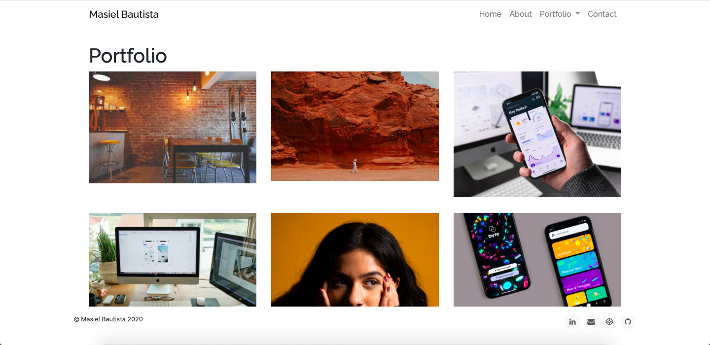

# Portfolio

## Table of Contents
* [Description](#description)
* [Technologies Used](#technologies-used)
* [Application Demo](#application-demo)
* [Contact Information](#contact-information)

## Description
Hi there, my name is Masiel Bautista and I am passionate about web design and improving user experiences. I recently graduated from the University of North Carolina at Chapel Hill where I studied Global Economics, Trade, and Development as well as Hispanic Linguistics. As a dedicated student and an avid tech user, I've learned first hand of the importance of the intersection between liberal arts and technology.

I decided to pursue computer programming when I noticed how web development and design allowed me to express more of my creativity. It also empowers me to work on projects end to end, from ideation all the way through development. I love aesthetically pleasing design and carefully organized code. For that reason, I decided to learn full-stack development after completing my undergraduate career.

## Technologies Used
* HTML 
* CSS
* Bootstrap

## Application

## Contact Me
Find me on GitHub: https://masielb.github.io/
Find me on LinkedIn: https://www.linkedin.com/in/masielbautista/ 